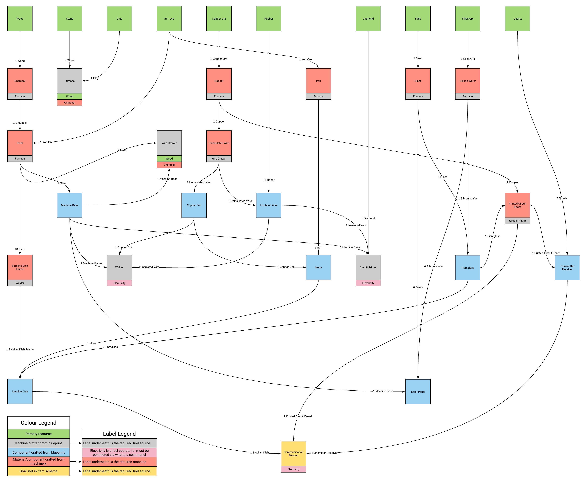

# Blueprint

Blueprint was created as part of the COMS30400 Group Project unit at the University of Bristol. 
This repository holds the *server* used for playing Blueprint.

## Game Outline
It is a game inspired by Minecraft and Pokémon Go, where the player finds themselves stranded on a distant planet, but discovers blueprints for building a communication beacon. 
In order to return home safely, they must build a communication beacon and signal for help using components and machines built from the discovered blueprints. 
However, there is a catch! The raw resources required to progress through the game cannot be collected on the desktop app - the player must log off and venture outside into the real world with the mobile app, and Hololens if available where they are presented with a map showing nearby raw resources the player can collect. 
Once the player is close enough to a resource, it will enable an Augmented Reality game to collect some quantity of the resource, determined by the players performance in the game.
Utilising the cloud, we synchronise the entire game remotely - allowing the player to seamlessly pick up where the left off, from any internet connected device.
The end goal is simple: build each of the blueprints one by one until you have the resources to rebuild the communication beacon.

## Technology Outline
- Developed using Docker to allow for easy deployment of containers on any operating system, and provide scalability via Docker Swarm
- Micro-service architecture for easy integration
- Well-documented API schema for easy integration
- Stores a serialised representation of players' desktop worlds, meaning players can login and carry on playing on any computer
- Account system with token based authentication

## Local Deployment Instructions

### Database setup

With a local MySQL server running, from the root directory execute the database creation script:

`> mysql -u DATABASE_USERNAME -p < database/create.sql`

Where `DATABASE_USERNAME` will depend on your local MySQL server credentials, by default it will be `root`.

Additionally, to preload the database with developer accounts for adding and removing resources, a second script will need to be run. Contact myself, @smithwjv, for the `dev.sql` script, and place it in the database directory, running it as before:

`> mysql -u DATABASE_USERNAME -p < database/dev.sql`

This script also adds test accounts for each account type: `developer`, `lecturer` and `player`.

### Configuration files

If necessary, edit the configuration file, `conf.json`, in the `authenticate`, `inventory`, `resource` and `progress` directories. The default values are:

* `"port": 8000`
* `"dbUsername": "root"`
* `"dbPassword": ""`
* `"dbHost": "host.docker.internal"`
* `"dbName": "blueprint"`

This configuration:
* Opens port 8000 of the Docker container
* Assumes credentials exist for the local MySQL database with a username of "root" and a blank password
* Assumes a MySQL server is hosted locally **not** within a Docker container, note this is OS specific
* The database name is set to "blueprint"

### Deployment

With the database and configuration files setup and Docker installed, to build the images for each service and deploy the server using Docker swarm, from the root directory type:

`> make`

You can check the services are running with:

`> docker service ls`

To stop the services and take down the Docker swarm, type:

`> make clean`

## Local Testing Instructions

With the database and configuration files setup and Docker installed, to build the images for each service and run the tests, from the root directory type:

`> make test`

## Item Schema

The item schema JSON, found in `progress/serve/`, can be visualised as an item tree:

(If not clear, the jpeg can be found in `schemas/images/`)

Where item types are:

| Item type |                  Meaning                  |
|:---------:|:-----------------------------------------:|
|     1     | Primary resource                          |
|     2     | Machine crafted from blueprint            |
|     3     | Material/component crafted from machinery |
|     4     | Component crafted from blueprint          |
|     5     | Intangible                                |

Though note, the communication beacon is not actually in the item schema, since it will be hardcoded into the desktop client. Also, currently all items aside from intangibles are placeable.

### Quick Reference

For quick item ID to item name reference:

| Item ID |          Name         |
|:-------:|:---------------------:|
|    1    |          Wood         |
|    2    |         Stone         |
|    3    |          Clay         |
|    4    |        Iron ore       |
|    5    |       Copper ore      |
|    6    |         Rubber        |
|    7    |        Diamond        |
|    8    |          Sand         |
|    9    |       Silica ore      |
|    10   |         Quartz        |
|    11   |        Furnace        |
|    12   |        Charcoal       |
|    13   |         Steel         |
|    14   |         Copper        |
|    15   |          Iron         |
|    16   |         Glass         |
|    17   |     Silicon wafer     |
|    18   |       Fibreglass      |
|    19   |      Machine base     |
|    20   |      Wire drawer      |
|    21   |    Uninsulated wire   |
|    22   |     Insulated wire    |
|    23   |      Copper coil      |
|    24   |         Motor         |
|    25   |      Solar panel      |
|    26   |         Welder        |
|    27   |  Satellite dish frame |
|    28   |     Satellite dish    |
|    29   |    Circuit printer    |
|    30   | Printed circuit board |
|    31   |  Transmitter receiver |
|    32   |      Electricity      |
