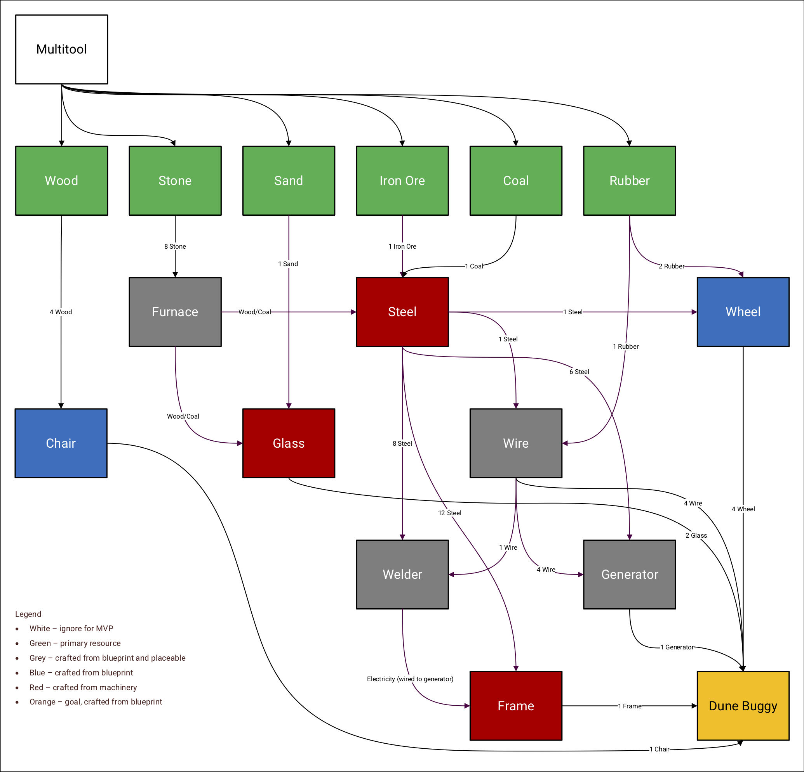

# Manhattan Server

The server for the game Blueprint by Manhattan, using Go, Docker and MySQL.

## Local Deployment Instructions

### Database setup

With a local MySQL server running, from the root directory execute the database creation script:

`> mysql -u DATABASE_USERNAME -p < /database/create.sql`

Where `DATABASE_USERNAME` will depend on your local MySQL server credentials.

Additionally, to preload the database with developer accounts for adding and removing resources, a second script will need to be run. Contact myself, @smithwjv, for the `dev.sql` script, and place it in the database directory, running it as before:

`> mysql -u DATABASE_USERNAME -p < /database/dev.sql`

### Configuration files

If necessary, edit the configuration file in the `authenticate`, `inventory` and `resource` directories. The default values are:

* `"port": 8000`
* `"dbUsername": "root"`
* `"dbPassword": ""`
* `"dbHost": "host.docker.internal"`
* `"dbName": "blueprint"`

This configuration:
* Opens port 8000 of the Docker container
* Assumes credentials exist for the local MySQL database with a username of "root" and a blank password
* Assumes a MySQL server is hosted locally **not** within a Docker container
* The database name is set to "blueprint"

The configuration file in the `resources` directory has an additional field for specifying developer account usernames, since only developer accounts can add or remove resources. The default values are:

* `"developers": [` 
    `{"username": "Will"},` 
    `{"username": "Jay"},` 
    `{"username": "Adam"},` 
    `{"username": "Andrei"},` 
    `{"username": "Ben"},` 
    `{"username": "Eli"}]` 

Though note developer account authentication will only work if accounts with these usernames exist in the database, see [Database Setup](#database-setup).

### Deployment

With the database and configuration files setup and Docker installed, to build the images for each service and deploy the server using Docker swarm, from the root directory type:

`> make`

You can check the services are running with:

`> docker service ls`

To stop the services and take down the Docker swarm, type:

`> make clean`

## Local Testing Instructions

With the database and configuration files setup and Docker installed, to build the images for each service and run the tests, from the root directory type:

`> make test`

## Item Schema

The item schema JSON can be visualised as an item tree:

Where item types match the item tree legend:

| Item type |                 Meaning                |
|:---------:|:--------------------------------------:|
|     1     |            Primary resource            |
|     2     |  Crafted from blueprint and placeable  |
|     3     | Crafted from blueprint and unplaceable |
|     4     | Crafted from machinery and unplaceable |
|     5     |    Crafted from blueprint and a goal   |

### Quick Reference

For quick item ID to item name reference:

| Item ID |    Name    |
|:-------:|:----------:|
|    1    |    wood    |
|    2    |    stone   |
|    3    |    sand    |
|    4    |  iron ore  |
|    5    |    coal    |
|    6    |   rubber   |
|    7    |   furnace  |
|    8    |    steel   |
|    9    |    wheel   |
|    10   |    chair   |
|    11   |    glass   |
|    12   |    wire    |
|    13   |   welder   |
|    14   |  generator |
|    15   |    frame   |
|    16   | dune buggy |
